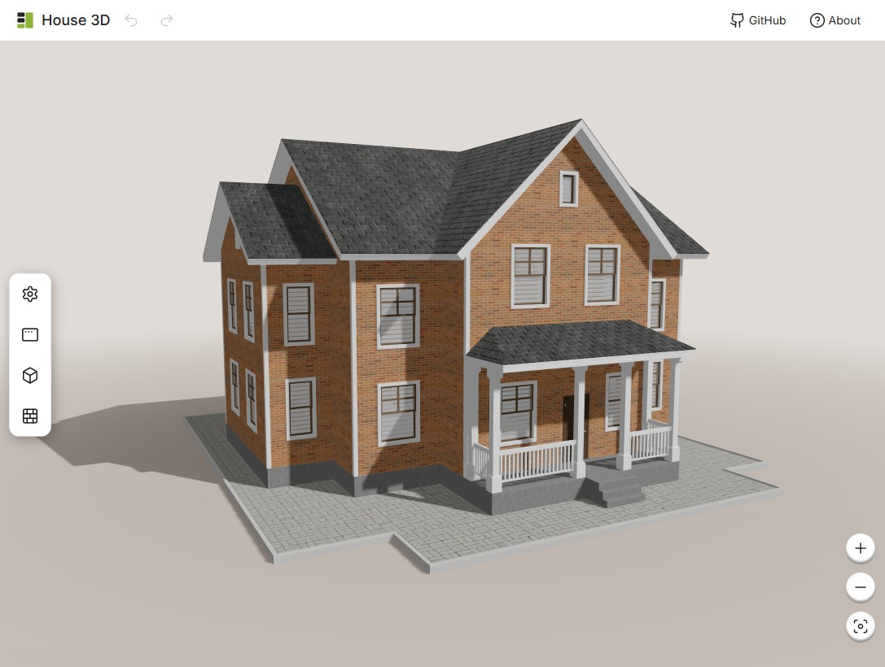

# House 3D

A web application for configuring a house in 3D. The project is built with Next.js, React, and Three.js and allows users to customize the building's appearance, change materials, lighting, camera settings, and scene parameters.

## Key Features

* 3D scene with house objects and environment;
* side and bottom configuration panels;
* texture and color selection for different house elements;
* lighting and shadow controls;
* camera and visual display settings;
* support for mobile/narrow viewports with a warning;
* state management using React Context with undo/redo support.

## Tech Stack

* Next.js 15
* React 19
* TypeScript
* Three.js
* Sass / CSS Modules
* Jest + Testing Library

## Project Structure

```text
app/                 # application pages and root layout
components/          # UI components, panels, drawers, scene elements
context/             # React contexts for settings, materials, and scene state
hooks/               # custom hooks for Three.js and scene updates
public/              # static images and textures
uikit/               # UI library / base components
utils/               # utility functions
```

## Requirements

* Node.js 18+
* npm or yarn

## Installation

```bash
npm install
```

## Development

```bash
npm run dev
```

After starting the development server, open:

```text
http://localhost:3000
```

## Build

```bash
npm run build
```

## Start Production Build

```bash
npm run start
```

## Testing

```bash
npm test
```

For coverage:

```bash
npm run test:coverage
```

## Linting

```bash
npm run lint
```

## Useful Links

* [Next.js Documentation](https://nextjs.org/docs)
* [Three.js Documentation](https://threejs.org/docs/)
* [React Documentation](https://react.dev/)

## Note

This project is an educational/demo application for visualizing a 3D environment and configuring house parameters directly in the browser.

## License

This project is licensed under the **MIT License**. See [LICENSE](LICENSE).
